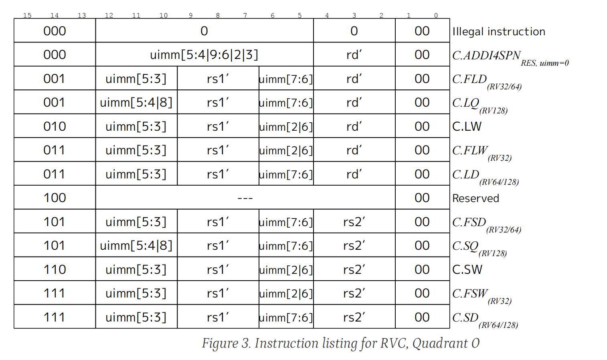
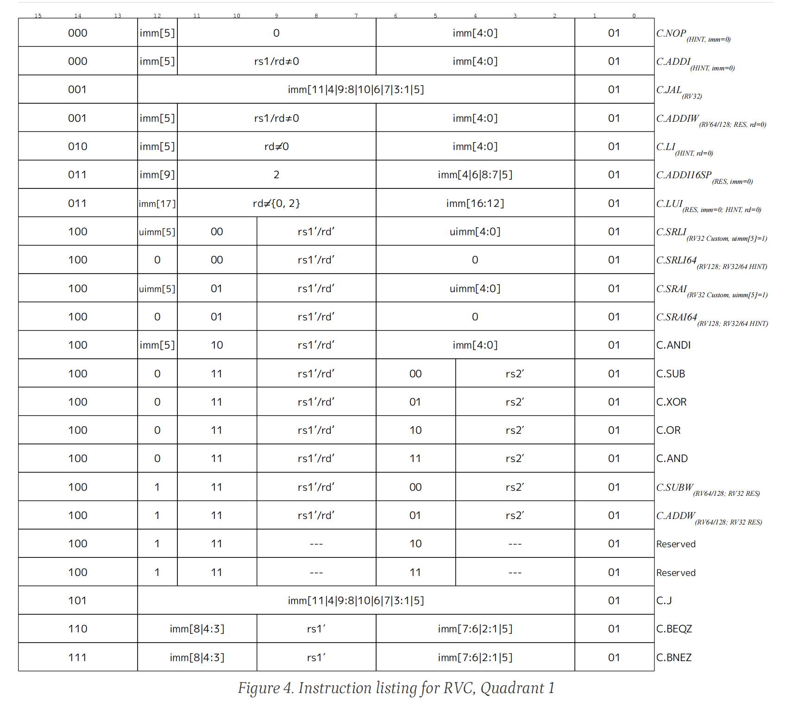
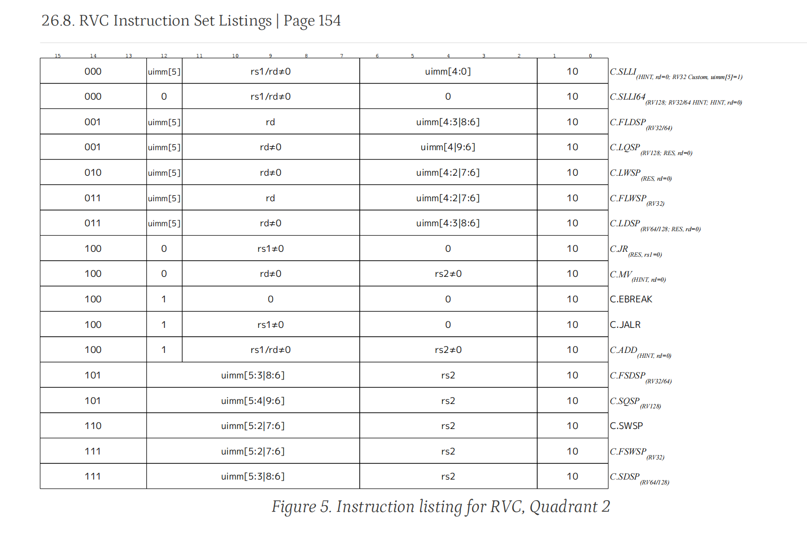

需要实现的变长指令有：`c.addi`，`c.jal`，`c.li`，`c.addi16sp`，`c.lui`，`c.srli`，`c.srai`，`c.andi`，`c.sub`，`c.xor`，`c.or`，`c.and`，`c.j`，`c.beqz`，`c.bnez`，`c.addi4spn`，`c.lw`，`c.sw`，`c.slli`，`c.jr`，`c.mv`，`c.jalr`，`c.add`，`c.lwsp`，`c.swsp`

具体指令组成请参考下表

如果想要得到更具体的信息，可以下载<https://riscv.org/technical/specifications/>中的PDF：
- Volume 1, Unprivileged Specification version 20240411 [[PDF](https://drive.google.com/file/d/1uviu1nH-tScFfgrovvFCrj7Omv8tFtkp/view)]

感谢李林璋同学提供需要实现的变长指令！如果发现文档有错误或遗漏，或者有任何疑问，请联系助教。