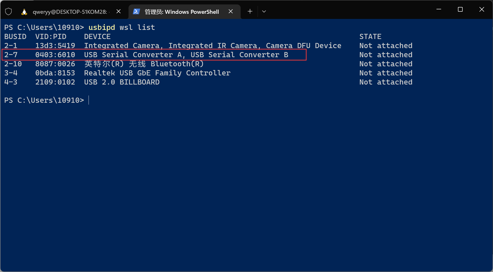
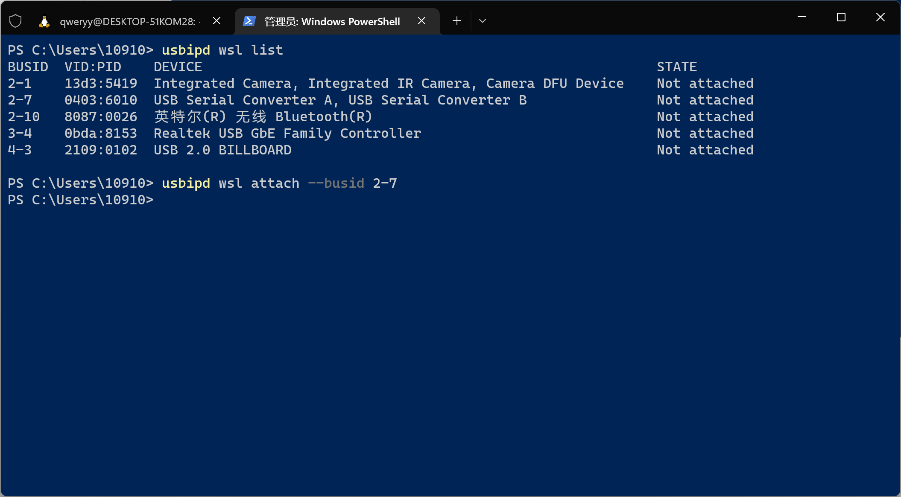
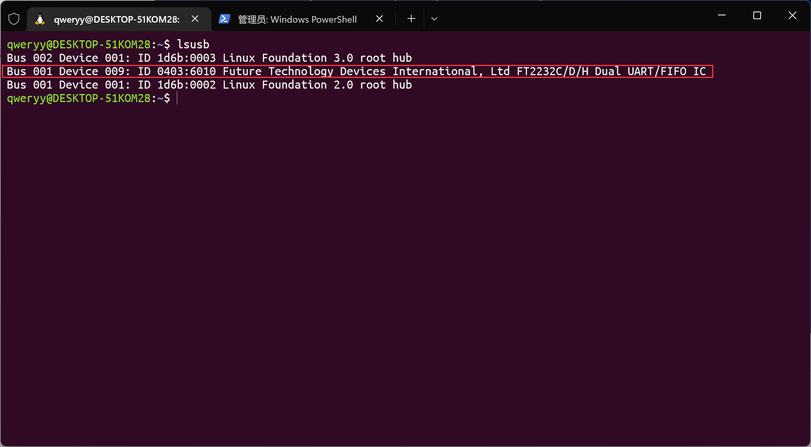

# Toy CPU 2024

基于 RV32IC 指令集。

## WSL2 上板指引

> Microsoft 官方文档：https://learn.microsoft.com/zh-cn/windows/wsl/connect-usb

### 预备

根据官方文档先完成 [USBIPD-WIN](https://learn.microsoft.com/en-us/windows/wsl/connect-usb#install-the-usbipd-win-project) 与 [USBIP tools and hardware database in Linux](https://learn.microsoft.com/en-us/windows/wsl/connect-usb#install-the-usbipd-win-project) 的安装。

### 将 `.bit` 文件写入板中

在使用数据线连接好 FPGA 板后根据`doc/vivadoDemo.pdf`操作即可（从`Run test`开始的教程无需参考，只参考如何写入`.bit`文件）。

### 连接 FPGA 板至 WSL2

注：接下来需要注意命令的运行环境（以**粗体**注明）。

1. 以管理员模式打开 **PowerShell**，输入以下命令列出所有连接到 Windows 的 USB 设备。

    ```powershell
    usbipd wsl list
    ```

    

2. 找到 FPGA 板（设备名称应该是 `USB Serial Converter A, USB Serial Converter B`）的 bus ID，然后执行

    ```powershell
    usbipd wsl attach --busid <busid>
    ```

    

3. 在 **WSL** 中，可以使用以下命令确认是否连接成功。

    ```bash
    lsusb
    ```

    

### 修改 `Makefile` 的端口`fpga_device`

与 WSL1 不同，应为 `/dev/ttyUSB1`（或者可能为其它数字，可以通过 attach 前后 `ls /dev/` 大致辨别）。

### 访问权限

通常情况下 attach 至 WSL2 的设备是不允许非 root 用户访问的。有几种方案：

1. 配置 udev 规则。~~我不会（）~~
2. 使用你喜欢的方式直接修改设备文件权限，例如

    ```bash
    sudo chmod 777 /dev/ttyUSB1
    ```
    
    不过在该种方法下，每次重新连接设备时都要执行一遍。

### 测试
先在`fpga/`文件夹下运行
```shell
make fpga
```
然后便可测试你的硬件代码，在仓库根目录下运行
```shell
make run_fpga
```

### 断开连接（或需要 reprogram 时）

当你需要对 FPGA 板重新编程时，需将板重新连回 Windows 中。在 **PowerShell** 下执行

```powershell
usbipd wsl detach --busid <busid>
```

以断开该设备与 WSL 的连接，然后你可以使用 Vivado 对其重新编程。当你准备好再次测试时，重复上述连接步骤即可。
